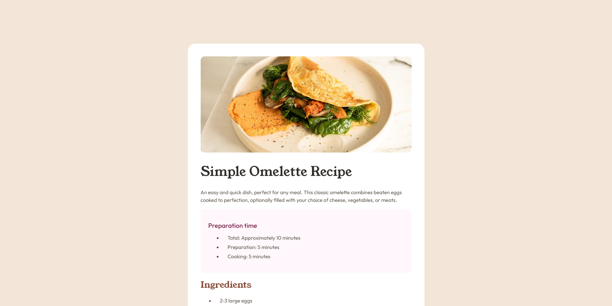

# Frontend Mentor - Recipe page solution

This is a solution to the [Recipe page challenge on Frontend Mentor](https://www.frontendmentor.io/challenges/recipe-page-KiTsR8QQKm). Frontend Mentor challenges help you improve your coding skills by building realistic projects. 

## Overview

### Screenshot

## My process

### Built with

- Semantic HTML5 markup
- CSS custom properties
- Flexbox
- @font-face

### What I learned

To add a border to a table, I need to first add `border-collapse: collapse;` on the table css. To customize a `
`, I need to use border properties. Changing the color of the list bullet is done by adding `li:mark { color: red;}` on the css file.

### Useful resources

- [Mozilla MDN](https://developer.mozilla.org/en-US/) - This helped me with styling the table.

## Author

- Frontend Mentor - [@yourusername](https://www.frontendmentor.io/profile/vercthu)
- Bluesky - [@camundonguinha.bsky.social](https://bsky.app/profile/camundonguinha.bsky.social)